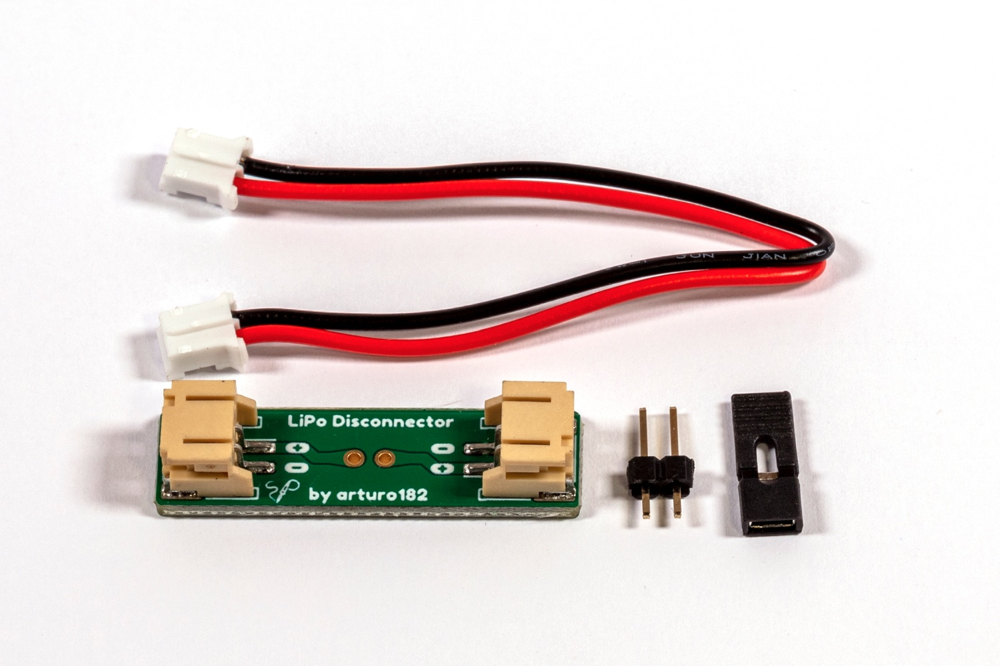

# LiPo Disconnector

This little board allows you to get inbetween a LiPo battery and a board/device that requires the battery. This way you can easily disconnect the LiPo from the device without having to remove the JST PH connector over and over, all you have to do is remove the jumper! You can also use the header on the Disconnector as a current-measuring point.

NOTE: Before connecting the battery, always make sure the polarity is correct.

# Links

For more information visit https://lipo-disconnector.solder.party/